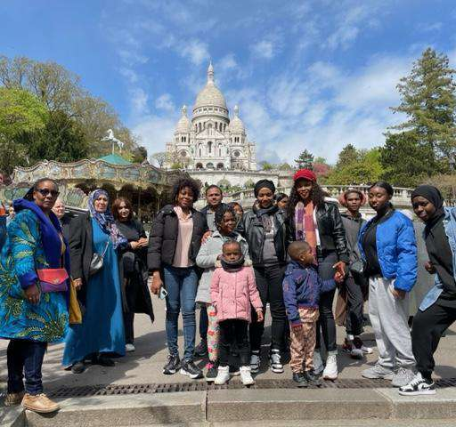

En 2023, Génération Femmes confirme son rôle de **point d'appui essentiel** pour les habitants d'Évry-Courcouronnes et des quartiers voisins. L'association poursuit un travail de proximité qui mêle écoute, accompagnement administratif et médiation sociale, avec une attention particulière portée aux familles qui rencontrent des démarches complexes ou des ruptures de parcours.

Quelques repères forts :

- **545 adhérents** mobilisés autour des actions de l'association.
- **2796 cas d'accompagnement** social et administratif traités.
- **780 collégiens** touchés par les actions en milieu scolaire.

L'année a aussi marqué une montée en puissance de l'accompagnement numérique. De nombreuses personnes ont pu être aidées sur smartphone ou en guichet pour relire un courrier, reprendre un dossier, compléter un formulaire ou préparer un rendez-vous. Ce travail, souvent discret, permet de lever des blocages très concrets et de redonner de l'autonomie dans les démarches du quotidien.

Sur le volet éducatif, les actions menées auprès des collégiens ont consolidé le lien entre familles, établissements scolaires et équipe de médiation. Le résultat est clair : plus d'autonomie, plus d'accès aux droits et davantage de continuité dans l'accompagnement des personnes.

Cette année 2023 confirme donc une dynamique durable : présence de terrain, confiance des habitants et capacité à répondre à des situations très variées avec des solutions simples, humaines et concrètes.

